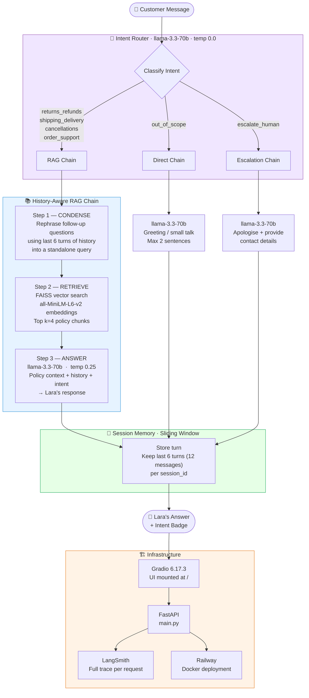
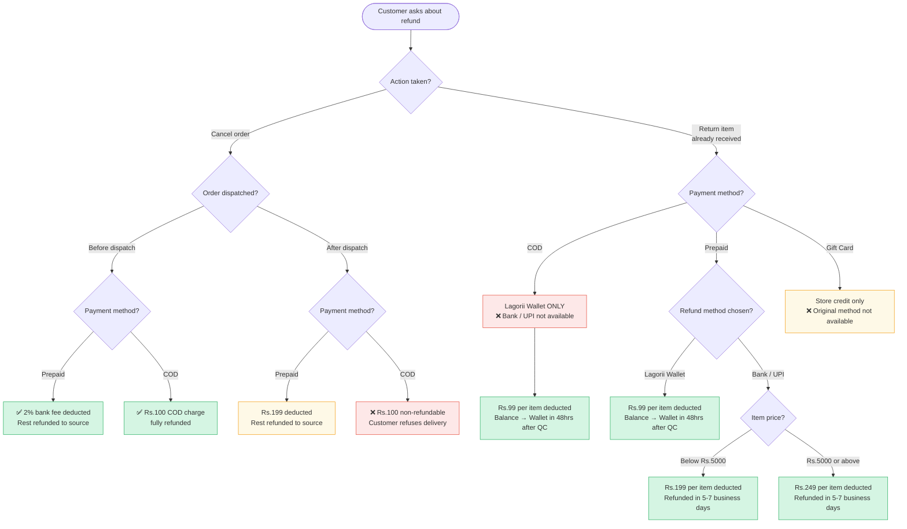
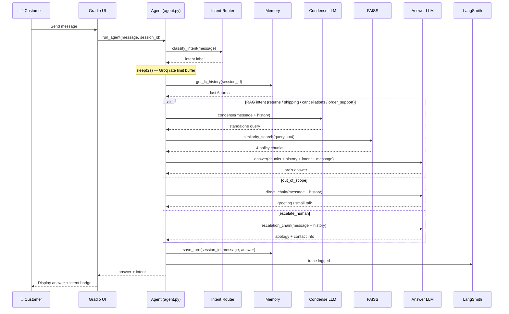

# Lara — AI Agent Architecture Diagrams

## 1. Full System Flow

```mermaid
flowchart TD
    A([👤 Customer Message]) --> B

    subgraph ROUTING ["🔀 Intent Router  ·  llama-3.3-70b  ·  temp 0.0"]
        B{Classify Intent}
        B -->|returns_refunds\nshipping_delivery\ncancellations\norder_support| C[RAG Chain]
        B -->|out_of_scope| D[Direct Chain]
        B -->|escalate_human| E[Escalation Chain]
    end

    subgraph RAG ["📚 History-Aware RAG Chain"]
        C --> F["Step 1 — CONDENSE\nRephrase follow-up questions\nusing last 6 turns of history\ninto a standalone query"]
        F --> G["Step 2 — RETRIEVE\nFAISS vector search\nall-MiniLM-L6-v2 embeddings\nTop k=4 policy chunks"]
        G --> H["Step 3 — ANSWER\nllama-3.3-70b  ·  temp 0.25\nPolicy context + history + intent\n→ Lara's response"]
    end

    subgraph MEMORY ["🧠 Session Memory  ·  Sliding Window"]
        I["Store turn\nKeep last 6 turns (12 messages)\nper session_id"]
    end

    D --> J["llama-3.3-70b\nGreeting / small talk\nMax 2 sentences"]
    E --> K["llama-3.3-70b\nApologise + provide\ncontact details"]

    H --> I
    J --> I
    K --> I

    I --> L(["💬 Lara's Answer\n+ Intent Badge"])

    subgraph INFRA ["🏗️ Infrastructure"]
        M["FastAPI\nmain.py"]
        N["Gradio 6.17.3\nUI mounted at /"]
        O["LangSmith\nFull trace per request"]
        P["Railway\nDocker deployment"]
    end

    L --> N
    N --> M
    M --> O
    M --> P

    style ROUTING fill:#f0e6ff,stroke:#9b59b6
    style RAG fill:#e6f3ff,stroke:#3498db
    style MEMORY fill:#e6ffe6,stroke:#27ae60
    style INFRA fill:#fff3e6,stroke:#e67e22
```

---

## 2. Refund Decision Tree

```mermaid
flowchart TD
    A([Customer asks about refund]) --> B{Action taken?}

    B -->|Cancel order| C{Order dispatched?}
    B -->|Return item\nalready received| F{Payment method?}

    C -->|Before dispatch| D{Payment method?}
    C -->|After dispatch| E{Payment method?}

    D -->|Prepaid| D1["✅ 2% bank fee deducted\nRest refunded to source"]
    D -->|COD| D2["✅ Rs.100 COD charge\nfully refunded"]

    E -->|Prepaid| E1["Rs.199 deducted\nRest refunded to source"]
    E -->|COD| E2["❌ Rs.100 non-refundable\nCustomer refuses delivery"]

    F -->|COD| G["Lagorii Wallet ONLY\n❌ Bank / UPI not available"]
    F -->|Prepaid| H{Refund method chosen?}
    F -->|Gift Card| I["Store credit only\n❌ Original method not available"]

    G --> G1["Rs.99 per item deducted\nBalance → Wallet in 48hrs after QC"]

    H -->|Lagorii Wallet| H1["Rs.99 per item deducted\nBalance → Wallet in 48hrs after QC"]
    H -->|Bank / UPI| J{Item price?}

    J -->|Below Rs.5000| J1["Rs.199 per item deducted\nRefunded in 5-7 business days"]
    J -->|Rs.5000 or above| J2["Rs.249 per item deducted\nRefunded in 5-7 business days"]

    style D1 fill:#d5f5e3,stroke:#27ae60
    style D2 fill:#d5f5e3,stroke:#27ae60
    style E1 fill:#fef9e7,stroke:#f39c12
    style E2 fill:#fde8e8,stroke:#e74c3c
    style G fill:#fde8e8,stroke:#e74c3c
    style G1 fill:#d5f5e3,stroke:#27ae60
    style H1 fill:#d5f5e3,stroke:#27ae60
    style J1 fill:#d5f5e3,stroke:#27ae60
    style J2 fill:#d5f5e3,stroke:#27ae60
    style I fill:#fef9e7,stroke:#f39c12
```

---

## 3. Per-Request Sequence

```mermaid
sequenceDiagram
    participant U as 👤 Customer
    participant G as Gradio UI
    participant A as Agent (agent.py)
    participant R as Intent Router
    participant M as Memory
    participant C as Condense LLM
    participant F as FAISS
    participant L as Answer LLM
    participant S as LangSmith

    U->>G: Send message
    G->>A: run_agent(message, session_id)
    A->>R: classify_intent(message)
    R-->>A: intent label
    Note over A: sleep(2s) — Groq rate limit buffer
    A->>M: get_lc_history(session_id)
    M-->>A: last 6 turns

    alt RAG intent (returns / shipping / cancellations / order_support)
        A->>C: condense(message + history)
        C-->>A: standalone query
        A->>F: similarity_search(query, k=4)
        F-->>A: 4 policy chunks
        A->>L: answer(chunks + history + intent + message)
        L-->>A: Lara's answer
    else out_of_scope
        A->>L: direct_chain(message + history)
        L-->>A: greeting / small talk
    else escalate_human
        A->>L: escalation_chain(message + history)
        L-->>A: apology + contact info
    end

    A->>M: save_turn(session_id, message, answer)
    A->>S: trace logged
    A-->>G: answer + intent
    G-->>U: Display answer + intent badge
```
